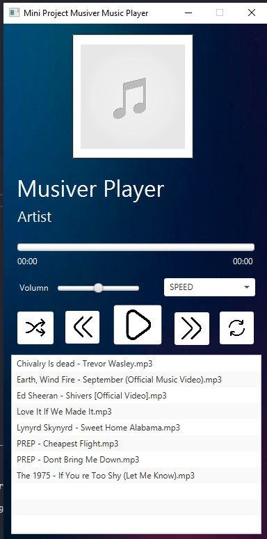

# # Introduction

Welcome to the 'Musiver' Music player Java project
made by pho0m & fon TCT-31 KMUTNB

## Getting Started
### In VScode
set in launch.json under request
<br />
use JavaFx 17
<br />: javafx.controls
<br />: javafx.fxml
<br />: javafx.media
```` 
"vmArgs": "--module-path [PATH OF JAVAFX]javafx-sdk-17.0.0.1/lib --add-modules javafx.controls,javafx.fxml,javafx.media",
````


